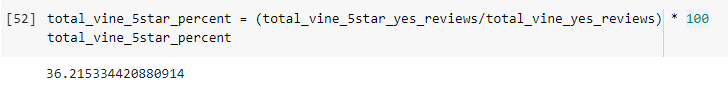

# Amazon_Vine_Analysis

## Overview

This project is for analyzing Amazon reviews written by members of the paid Amazon Vine program. The Amazon Vine program is a service that allows manufacturers and publishers to receive reviews for their products. Companies pay a small fee to Amazon and provide products to Amazon Vine members, who are then required to publish a review.

Following tasks are done for the project:

 - Perform ETL on Amazon Product Reviews
 - Determine Bias of Vine Reviews
 - Report on the Analysis

Software:
 - Google colab
 - Python jupyter notebook
 - AWS S3 and RDS with PostgreSQL
 

## Results

### Total Reviews
  This is a subset of results that have 
   - Total votes higher than 19
   - Total helpful votes to Total votes ratio is grater than 50%

  
  
  
  
### Vine Reviews

  
  

### Non Vine Reviews

  
  

### 5 Star Vine Reviews

  

### 5 Star Non Vine Reviews

  
  

### Statistics
#### 5 star percentage of non vine reviews

#### 5 star percentage of vine reviews

#### total reviews: vine reviews + non vine reviews:

## Summary
Based on the data we have seen above we can safely say that there is no positivity bias for reviews in the Vine program. 
Percentage of 5 star reviews are higher in non-Vine reviews than Vine reviews indicates that there is no positive bias in Vine program.

### Additional analysis to support the statement
We could do a t-test to support the above statement.

